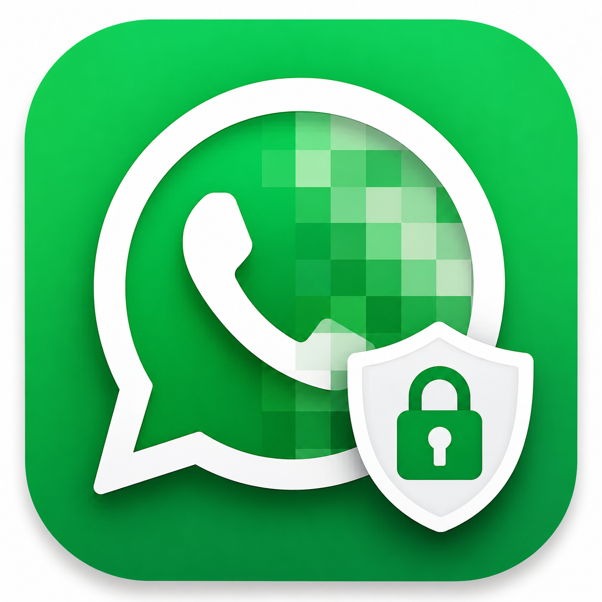

# WA Privacy — WhatsApp Web Privacy Extension

Ekstensi Chrome untuk WhatsApp Web yang menambahkan tema glassmorphism gelap sekaligus memblur nama kontak dan avatar di chat list — cocok dipakai saat presentasi, screensharing, atau kerja di tempat umum.



---

## Fitur

- **Privacy blur** — nama kontak, preview pesan, dan avatar di chat list diblur secara default. Hover untuk melihat sebentar.
- **Toggle shortcut** — `Ctrl + Shift + 0` (Windows/Linux) atau `Cmd + Shift + 0` (Mac) untuk menyalakan/mematikan blur tanpa reload.
- **Toast notifikasi** — konfirmasi visual kecil setiap kali status blur berubah.
- **Tema gelap glassmorphism** — tampilan WhatsApp Web dirombak total: background gradient, panel kaca, bubble pesan biru/putih transparan, floating header, dan floating compose bar.

---

## Instalasi via Unpacked Extension (Chrome)

Karena ekstensi ini belum dipublikasikan ke Chrome Web Store, pemasangannya dilakukan secara manual lewat mode **Developer**.

### Langkah-langkah

**1. Download / clone repo ini**

```bash
git clone https://github.com/YOUR_USERNAME/whatsapp-blur.git
```

Atau download sebagai ZIP dan ekstrak ke folder yang mudah diingat (misalnya `~/Extensions/whatsapp-blur`).

**2. Buka halaman Extensions di Chrome**

Ketik di address bar:

```
chrome://extensions
```

**3. Aktifkan Developer Mode**

Di pojok kanan atas halaman Extensions, nyalakan toggle **"Developer mode"**.


**4. Load ekstensi**

Klik tombol **"Load unpacked"** yang muncul di kiri atas, lalu pilih folder hasil clone/ekstrak tadi (folder yang berisi `manifest.json`).

**5. Buka WhatsApp Web**

Buka [https://web.whatsapp.com](https://web.whatsapp.com) — tampilan langsung berubah dan blur aktif.

---

## Cara Pakai

| Aksi | Shortcut |
|---|---|
| Toggle blur ON/OFF | `Cmd + Shift + 0` (Mac) / `Ctrl + Shift + 0` (Win/Linux) |
| Lihat kontak sebentar | Hover cursor ke chat list item |

Status blur ditampilkan lewat toast notifikasi di bagian bawah layar.

---

## Struktur File

```
whatsapp-blur/
├── manifest.json   # Konfigurasi ekstensi (Manifest v3)
├── content.js      # Logika toggle blur + toast notification
├── style.css       # Tema glassmorphism + aturan blur CSS
└── icon.png        # Ikon ekstensi
```

---

## Catatan

- Ekstensi ini hanya bekerja di **WhatsApp Web** (`web.whatsapp.com`).
- Karena WhatsApp Web sering update struktur HTML-nya, beberapa selector CSS mungkin perlu disesuaikan jika tampilan mendadak tidak berubah.
- Tidak ada data yang dikirim ke server manapun — semua berjalan lokal di browser.

---

## Lisensi

MIT
